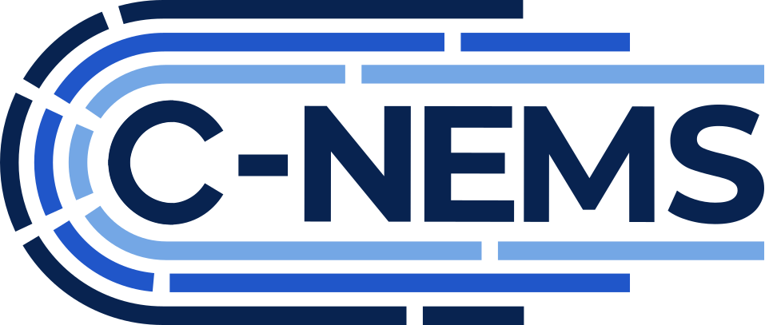

  

### The Community National Energy Modeling System (C-NEMS)

C-NEMS is a continuation of [Project BlueSky](https://www.eia.gov/totalenergy/data/bluesky/), an effort to build the next-generation energy-economy modeling framework at the U.S. Energy Information Administration (EIA). When federal project activity paused, a group of former EIA staff and partners came together to carry it forward as a fully open-source project, built by and for the modeling community.

Like EIA's National Energy Modeling System ([NEMS](https://www.eia.gov/outlooks/aeo/info_nems_archive.php)), C-NEMS is modular: each energy sector is modeled using the logic that best reflects real-world market dynamics, rather than forcing every sector through one mathematical structure. We are adapting that modular framework to be more flexible and nimble, so it can keep pace with questions about a rapidly changing energy system. Its structure can evolve along with the questions being asked.

**[c-nems.org](https://c-nems.org)** &nbsp;·&nbsp; [About the project](https://c-nems.org/about.html) &nbsp;·&nbsp; [Team](https://c-nems.org/team.html) &nbsp;·&nbsp; [Advisory Board](https://c-nems.org/advisory-board.html)

### Repositories

- **[cnems-models](https://github.com/Community-NEMS/cnems-models)**: Model code and documentation
- **[cnems-inputs](https://github.com/Community-NEMS/cnems-inputs)**: Data pipelines and documentation that turn raw data into model-ready inputs

### Get involved

C-NEMS is in active development, built module by module. Follow along, open an issue, contribute a pull request, or reach out to [info@c-nems.org](mailto:info@c-nems.org) if you'd like to help shape where it goes next.
